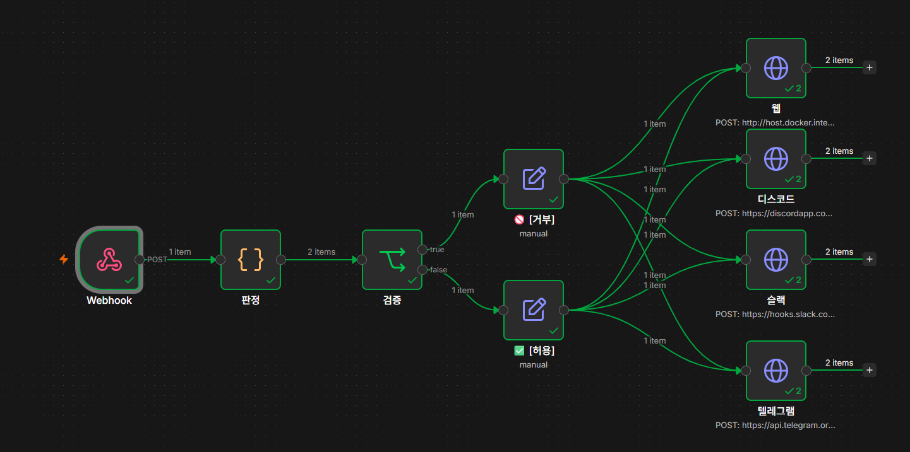
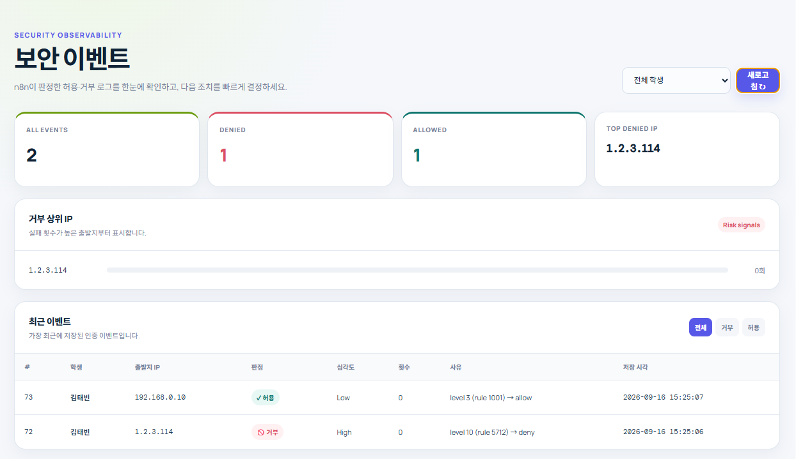
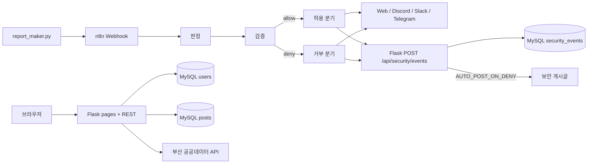
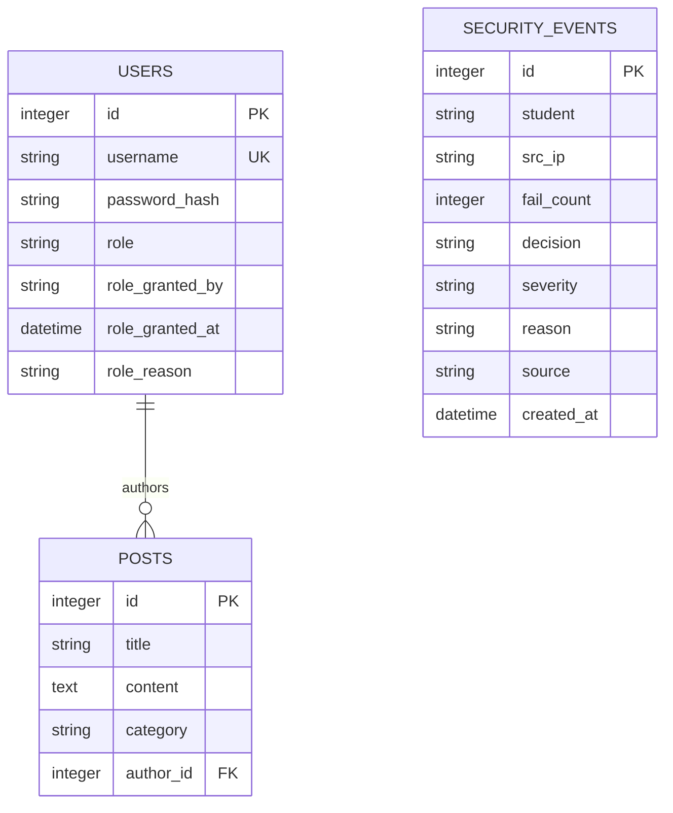

# ALRAM Bot

> n8n과 Flask를 연결해 로그인 경보를 판정하고, 보안 이벤트를 기록·통지하는 자동화 실습 프로젝트

<p align="center">
  
</p>

<p align="center">
  
  
  
  
</p>

## 목차

- [프로젝트 소개](#프로젝트-소개)
- [주요 기능](#주요-기능)
- [화면 구성](#화면-구성)
- [빠른 시작](#빠른-시작)
- [사용 방법](#사용-방법)
- [API](#api)
- [환경 변수](#환경-변수)
- [기술 스택](#기술-스택)
- [시스템 구조](#시스템-구조)
- [데이터 모델](#데이터-모델)
- [프로젝트 구조](#프로젝트-구조)
- [주요 구현 내용](#주요-구현-내용)
- [검증](#검증)
- [향후 개선](#향후-개선)

## 프로젝트 소개

ALRAM Bot은 로그인 경보를 단순한 콘솔 출력에서 끝내지 않고, n8n 워크플로우와 Flask 웹 애플리케이션으로 이어지는 운영 흐름을 보여 주는 프로젝트입니다. 경보 데이터는 n8n의 웹훅으로 전달되고, 판정 결과에 따라 허용·거부 분기와 외부 알림 채널로 연결할 수 있습니다.

Flask 애플리케이션에서는 게시판, 보안 이벤트 대시보드, 등급별 접근 제어, 관리자 권한 관리, 부산 테마여행 공공데이터 조회 화면을 제공합니다. 프로젝트의 핵심은 `기록(Record) → 보호(Protect) → 통지(Notify)` 흐름을 하나의 포트폴리오 형태로 구성한 데 있습니다.

현재 저장소에는 Flask 애플리케이션과 Python 보조 스크립트가 포함되어 있으며, n8n 워크플로우는 이미지로 흐름을 기록하고 있습니다. n8n export JSON 파일이나 외부 배포 주소는 저장소에서 확인되지 않아 README에 임의로 추가하지 않았습니다.

## 주요 기능

### 경보 심각도 분류

- [`detect.py`](detect.py)의 `severity()`가 경보 레벨을 `High`, `Medium`, `Low`로 분류합니다.
- 레벨 `10` 이상은 `High`, `7` 이상은 `Medium`, 그 외는 `Low`로 판정합니다.

### Markdown 리포트 생성 및 n8n 전송

- [`report_maker.py`](report_maker.py)가 경보 목록을 Markdown 표로 만들고 `report.md`로 저장합니다.
- `source`, `generated_at`, `count`, `text`, `alerts`를 포함한 JSON payload를 n8n 웹훅으로 전송합니다.
- HTTP timeout은 10초이며, 실패 시 최대 3회 재시도하고 지수형 대기(`2초 → 4초`)를 사용합니다.

### 게시판 및 인증

- 회원가입·로그인과 JWT 기반 인증을 제공합니다.
- 게시글 목록은 커서 기반 조회와 제목·내용 검색, 카테고리 필터를 지원합니다.
- 게시글 작성·수정·삭제는 로그인한 작성자만 수행할 수 있습니다.

### 보안 이벤트 대시보드

- n8n이 `POST /api/security/events`로 보낸 허용·거부 결과를 저장합니다.
- 학생별 필터, 허용·거부 건수, 거부 상위 IP, 최근 이벤트 테이블을 제공합니다.
- API Key가 비어 있거나 일치하지 않으면 이벤트 저장 요청을 거부하는 fail-closed 정책을 적용합니다.

### RBAC 및 과잉권한 회수

- `user < gold < admin` 계층형 역할을 사용합니다.
- 골드 화면은 서버 API에서도 `gold` 이상인지 검사하며, 관리자 화면은 `admin` 권한을 요구합니다.
- [`privilege_revoke_bot.py`](_7_board_test/privilege_revoke_bot.py)는 허용목록 밖의 `admin` 계정을 찾아 Graylog GELF로 신고합니다.
- n8n 또는 봇이 권한을 회수하면 `security_events`에 감사 이벤트를 남깁니다.

### 부산 테마여행 공공데이터

- Flask 프록시가 부산 공공데이터 API를 호출합니다.
- 목록과 상세 화면에서 장소명, 썸네일, 원본 이미지, 설명을 확인할 수 있습니다.

## 화면 구성

### n8n 자동화 흐름

웹훅으로 들어온 경보가 `판정 → 검증 → 허용·거부 분기`를 거쳐 웹, Discord, Slack, Telegram 노드로 이어지는 실제 n8n 워크플로우 화면입니다.


### 보안 이벤트 대시보드

허용·거부 건수와 거부 상위 IP, 최근 이벤트를 한 화면에서 확인하는 Flask 화면입니다.



## 빠른 시작

### 요구 사항

- Python 3 실행 환경
- `requirements.txt`에 정의된 Python 패키지 설치 권한
- Flask 앱을 실행하는 경우 접속 가능한 MySQL 데이터베이스
- n8n 연동을 사용할 경우 접근 가능한 n8n 웹훅

저장소에는 Python의 최소 버전이나 외부 서비스의 배포 주소가 별도로 고정되어 있지 않습니다.

### 설치

```powershell
cd alram_bot
python -m venv .venv
.\.venv\Scripts\Activate.ps1
pip install -r requirements.txt
```

### 환경 설정

공유용 예시 파일을 복사한 뒤 값을 입력합니다.

```powershell
Copy-Item _7_board_test\.env.example _7_board_test\.env
```

`.env`에는 데이터베이스 주소, JWT 서명 키, 보안 이벤트 API Key, 관리자 API Key, 부산 공공데이터 서비스 키를 입력합니다. 실제 키와 비밀번호는 저장소에 커밋하지 마세요.

### Flask 앱 실행

```powershell
cd _7_board_test
python app.py
```

실행 후 브라우저에서 `http://localhost:5000`에 접속합니다. 앱 시작 시 `db.create_all()`이 필요한 테이블을 만들고, 기존 `users` 테이블에 역할·감사 컬럼이 없으면 `_ensure_schema()`가 보강합니다.

### 경보 리포트 실행

```powershell
cd ..
python report_maker.py
```

현재 [`report_maker.py`](report_maker.py)는 `N8N_WEBHOOK_URL` 환경 변수에서 n8n 웹훅 주소를 읽습니다. 실행 전 본인의 웹훅 주소를 설정하고, URL이나 토큰을 공개 저장소에 남기지 않도록 주의하세요.

## 사용 방법

### 기본 웹 흐름

1. `/`에서 회원가입 또는 로그인을 수행합니다.
2. 게시판에서 카테고리·검색어로 글을 조회합니다.
3. 로그인한 사용자는 글을 작성하고 본인이 작성한 글을 수정·삭제할 수 있습니다.
4. `/dashboard`에서 n8n이 기록한 허용·거부 이벤트와 거부 상위 IP를 확인합니다.
5. `gold` 이상 계정은 `/gold`, `admin` 계정은 `/admin`에 접근합니다.

### n8n 보안 이벤트 전송 예시

`SECURITY_API_KEY`는 환경 변수에 보관하고, 요청 헤더로만 전달합니다.

```bash
curl -X POST "http://localhost:5000/api/security/events" \
  -H "Content-Type: application/json" \
  -H "X-API-Key: <SECURITY_API_KEY>" \
  -d '{
    "student": "demo-student",
    "src_ip": "192.0.2.10",
    "fail_count": 3,
    "decision": "deny",
    "severity": "High",
    "reason": "login failure threshold exceeded",
    "source": "login_guard"
  }'
```

`decision`은 `allow` 또는 `deny`여야 하며, `deny`이고 `AUTO_POST_ON_DENY=1`이면 시스템 계정 `soarbot`으로 보안 게시글을 자동 생성할 수 있습니다.

### 역할별 접근 범위

| 역할 | 접근 범위 |
| --- | --- |
| `user` | 기본 게시판, 일반 API |
| `gold` | `user` 범위 + `/gold` 및 골드 게시글 |
| `admin` | `gold` 범위 + `/admin` 회원 역할 관리 |

## API

### 인증·게시판

| Method | Path | 인증 | 설명 |
| --- | --- | --- | --- |
| `POST` | `/api/auth/register` | 없음 | 회원가입 |
| `POST` | `/api/auth/login` | 없음 | JWT 발급 |
| `GET` | `/api/auth/me` | JWT | 현재 사용자·역할 조회 |
| `GET` | `/api/posts` | 없음 | 게시글 목록·검색·카테고리·커서 조회 |
| `POST` | `/api/posts` | JWT | 게시글 작성 |
| `PUT` | `/api/posts/{id}` | JWT | 본인 게시글 수정 |
| `DELETE` | `/api/posts/{id}` | JWT | 본인 게시글 삭제 |

### 보안·권한·공공데이터

| Method | Path | 인증 | 설명 |
| --- | --- | --- | --- |
| `POST` | `/api/security/events` | `X-API-Key` | n8n 보안 이벤트 저장 |
| `GET` | `/api/security/events` | 없음 | 이벤트 목록 조회 |
| `GET` | `/api/security/events/summary` | 없음 | 허용·거부 요약과 상위 IP |
| `GET` | `/api/security/students` | 없음 | 학생 필터 목록 |
| `GET` | `/api/gold/posts` | JWT + `gold` 이상 | 골드 게시글 조회 |
| `GET` | `/api/admin/users` | `X-API-Key` 또는 admin JWT | 회원·역할 조회 |
| `GET` | `/api/admin/violations` | `X-API-Key` 또는 admin JWT | 허용목록 밖 admin 조회 |
| `POST` | `/api/admin/grant` | `X-API-Key` 또는 admin JWT | 역할 부여 |
| `POST` | `/api/admin/revoke` | `X-API-Key` 또는 admin JWT | 역할 회수 및 감사 이벤트 생성 |
| `GET` | `/api/public/posts` | 없음 | 부산 공공데이터 프록시 |

## 환경 변수

공유용 설정 예시는 [`_7_board_test/.env.example`](_7_board_test/.env.example)에 있습니다.

| 변수 | 용도 |
| --- | --- |
| `DATABASE_URL` | MySQL 접속 URL |
| `JWT_SECRET_KEY` | JWT 서명 키 |
| `SECURITY_API_KEY` | n8n의 보안 이벤트 저장 요청 인증 |
| `AUTO_POST_ON_DENY` | 거부 이벤트의 보안 게시글 자동 생성 여부 (`1`이면 활성화) |
| `ADMIN_API_KEY` | 관리자 API의 기계 호출 인증. 비어 있으면 `SECURITY_API_KEY` 사용 |
| `ADMIN_ALLOWLIST` | admin 권한을 허용할 사용자 목록(쉼표 구분) |
| `PUBLIC_API_KEY` | 부산 공공데이터포털 서비스 키 |
| `BOARD_URL` | 회수봇이 접근할 Flask 주소. 기본값 `http://localhost:5000` |
| `GRAYLOG_HOST` | 회수봇의 GELF 수신 호스트. 기본값 `localhost` |
| `GRAYLOG_PORT` | 회수봇의 GELF UDP 포트. 기본값 `12201` |
| `STUDENT` | 회수봇 이벤트에 기록할 식별자 |
| `BOARD_SRC_IP` | 회수봇 이벤트에 기록할 대표 IP |

`report_maker.py`는 `N8N_WEBHOOK_URL`이 비어 있으면 전송하지 않고 설정 누락으로 종료합니다. 실제 웹훅 주소는 로컬 환경 변수로만 관리하세요.

## 기술 스택

| 영역 | 기술 | 사용 목적 |
| --- | --- | --- |
| 언어 | Python | 경보 분류, 리포트 생성, Flask 서버·회수봇 |
| 웹 서버 | Flask `3.0.2` | HTML 페이지와 REST API 제공 |
| 인증 | Flask-JWT-Extended `4.6.0` | 로그인 토큰 발급·검증 |
| ORM | Flask-SQLAlchemy `3.1.1`, SQLAlchemy `2.0.52` | 모델 정의와 데이터베이스 접근 |
| 데이터베이스 드라이버 | PyMySQL `1.1.0` | MySQL 연결 |
| 외부 API | Requests `2.34.2` | n8n 웹훅·부산 공공데이터 API 호출 |
| 자동화 | n8n | 경보 판정, 검증, 알림 채널 분기 |
| 테스트 | pytest `9.1.1` | 인증·RBAC·공공 API 라우트·템플릿 회귀 검증 |
| UI | HTML, CSS, Jinja2 템플릿 | 반응형 게시판·운영 화면 |

## 시스템 구조



경보 이벤트는 API Key로 보호되는 Flask 엔드포인트를 통해 `security_events`에 저장됩니다. 거부 이벤트 자동 게시를 켜면 이벤트와 보안 게시글을 같은 트랜잭션으로 커밋하며, 사람의 화면 접근은 JWT와 역할 계층으로 별도 검사합니다.

## 데이터 모델



`posts.author_id`는 `users.id`를 참조합니다. `security_events`는 사용자 FK 대신 `student`, `source`, `users` 같은 감사 정보를 이벤트 payload에 보관하는 독립 테이블입니다.

## 프로젝트 구조

```text
alram_bot/
├── detect.py                         # 경보 레벨 → 심각도 분류 예제
├── report_maker.py                   # Markdown 리포트 생성 및 n8n 웹훅 전송
├── requirements.txt                  # Python 의존성
├── docs/images/                       # README 대표 이미지
└── _7_board_test/
    ├── app.py                        # Flask 앱 팩토리와 실행 진입점
    ├── config.py                     # .env 기반 설정
    ├── privilege_revoke_bot.py       # 과잉 admin 탐지·Graylog 신고 봇
    ├── controllers/
    │   ├── auth_controller.py        # 회원가입·로그인·내 정보
    │   ├── post_controller.py        # 게시글 CRUD
    │   ├── security_controller.py    # n8n 보안 이벤트 REST
    │   ├── admin_controller.py       # 역할 부여·회수·위반 조회
    │   └── public_controller.py      # 부산 공공데이터 프록시
    ├── models/                       # User·Post·SecurityEvent 모델
    ├── templates/                    # 게시판·대시보드·관리자 화면
    ├── static/app.css                # 공통 반응형 UI 스타일
    ├── tests/                        # API·RBAC·템플릿 테스트
    └── .env.example                  # 공유 가능한 설정 템플릿
```

## 주요 구현 내용

### Fail-closed API 인증

`security_controller.py`와 `admin_controller.py`는 설정된 키가 없거나 요청 키가 다르면 기계 호출을 허용하지 않습니다. 운영 환경에서 실수로 빈 키를 배포해 API가 열리는 상황을 피하기 위한 선택입니다.

### 화면·서버 이중 권한 검사

골드 화면은 `/api/auth/me` 결과에 따라 예외 화면을 보여 주지만, 실제 데이터는 `/api/gold/posts`에서도 역할을 검사합니다. 관리자 API도 관리자 화면의 로그인 상태와 별개로 admin JWT 또는 유효한 API Key를 서버에서 확인합니다.

### 거부 이벤트와 보안 게시글의 원자적 처리

`AUTO_POST_ON_DENY`가 활성화된 경우 `security_events` 저장과 `soarbot` 보안 게시글 생성을 같은 트랜잭션으로 처리합니다. 한쪽만 저장되는 상태를 줄이고 대시보드와 게시판의 기록을 맞춥니다.

### 권한 회수의 감사 추적

역할 변경 시 부여자·시각·사유를 `users`에 저장하고, 실제 회수 시 `privilege-guard` 출처의 거부 이벤트를 `security_events`에 추가합니다. 회수봇은 탐지·신고를 담당하고, n8n이 API를 호출해 대응하는 경로를 기본 흐름으로 둡니다.

## 검증

### 자동 검증

| 명령 | 목적 | 결과 |
| --- | --- | --- |
| `python -m pytest -q` | 인증·RBAC·공공 API·템플릿 회귀 | `23 passed` |
| Flask test client 화면 확인 | `/`, `/dashboard`, `/gold`, `/admin`, `/public-posts`, `/public-posts/1` 렌더링 | 모두 `200` |
| Flask test client 정적 파일 확인 | `/static/app.css` 응답 확인 | `200`, `text/css` |
| 인라인 JavaScript 파싱 | 주요 템플릿 script 문법 확인 | 통과 |

현재 테스트 실행에서는 JWT HMAC 키 길이에 대한 기존 경고 17건이 출력되지만, 테스트 실패는 없습니다. 운영 환경에서는 32자 이상의 랜덤 `JWT_SECRET_KEY`를 사용해야 합니다.

### 수동 확인

1. `_7_board_test/.env.example`을 복사하고 DB·API Key 값을 설정합니다.
2. `python app.py`로 Flask 앱을 실행합니다.
3. 회원가입·로그인 후 게시글 작성과 본인 글 수정·삭제를 확인합니다.
4. n8n에서 보안 이벤트를 전송하고 `/dashboard`에서 허용·거부 집계를 확인합니다.
5. `gold` 또는 `admin` 역할을 부여한 뒤 `/gold`와 `/admin` 접근 범위를 확인합니다.

## 향후 개선

- n8n 워크플로우 export JSON을 저장소에 추가해 가져오기/재현 절차를 정리합니다.
- n8n 워크플로우 export JSON을 저장소에 추가해 이미지 없이도 재현 가능하게 합니다.
- 수동 확인 흐름을 브라우저 E2E 테스트로 확장합니다.
- `_ensure_schema()` 기반의 경량 마이그레이션을 정식 migration 도구로 교체합니다.
- GitHub Actions에서 테스트를 자동 실행하고, 공개 저장소에 맞는 라이선스와 기여 정책을 추가합니다.
